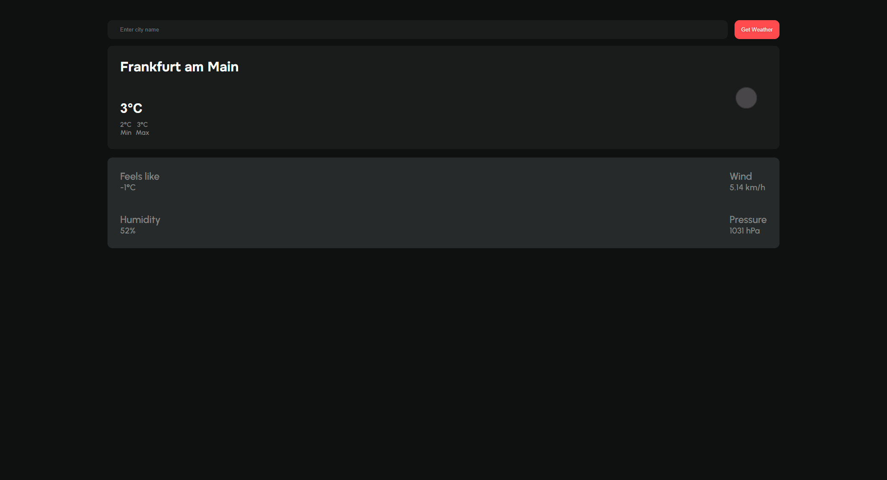

# Weather Dashboard 🌦️

A server-side rendered weather dashboard with **Next.js**, **TypeScript**, and **SCSS**




A modern, server-side rendered weather dashboard built with **Next.js**, **TypeScript**, and **SCSS**, integrating the **OpenWeatherMap API** to display real-time weather data, including rounded min/max temperatures. The app features a dark/light mode toggle based on system preferences, input sanitization for security, and is deployed on Vercel.

## Live Demo
- **Demo:** [Weather Dashboard on Vercel](https://weather-dashboard-3nun49p8h-jan-kortmanns-projects.vercel.app/)
- **GitHub Repository:** [jankortmann/weather-dashboard](https://github.com/jankortmann/weather-dashboard)

## Features
- **Real-Time Weather Data:** Fetches curretn weather data using the OpenWeatherMap API.
- **Min/Max Temperatures:** Displays rounded minimum and maximum temeperatures for the current day.
- **Dark/Light Mode:** Supports system preference-based theme switching.
- **Multi Localization:** Supports English, German, Spanish, French, and Mandarin.
- **Responsive Design:** Styled with SCSS for a UI that works on Mobile, Desktop, and Ultrawide Viewports.
- **Security:** Implemented input sanitization, rate limiting on API routes, and security headers.
- **Performance:** Achieves a Lighthouse score of 90+ for perofrmance, accessibility, and SEO.

## 🛠️ Tech Stack
- **Framework:** Next.js (Application Router)
- **Language:** TypeScript
- **Styling:** SCSS (with CSS Modules)
- **API:** OpenWeatherMap API
- **Deployment:** Vercel
- **Security:** Custom security headers, rate limiting, and environment variable management

## Getting Started

### Prerequisites
- Node.js (v18.x recommended)
- npm or yarn
- An OpenWeatherMap API key (sign up at [openweathermap.org](https://openweathermap.org))

### Installation
1. Clone the repository:
    ```bash
    git clone https://github.com/jankortmann/weather-dashboard.git
    cd weather-dashboard
2. Install dependencies:
    ```bash
    npm install
3. Create a .env.local file in the root directory and add your OpenWeatherMap API key:
    ```bash
    OPENWEATHERMAP_API_KEY=api_key_here
4. Run the dev server:
    ```bash
    npm run dev
5. Open http://localhost:3000 in your browser to see the app.

## Future Improvements
- Adding a live weather Map.
- Weather forecasting.
- More Languages.

## Author
**Jan Kortmann**
GitHub: jankortmann
Email: jan@jankortmann.com

Built with ❤️ using Next.js.